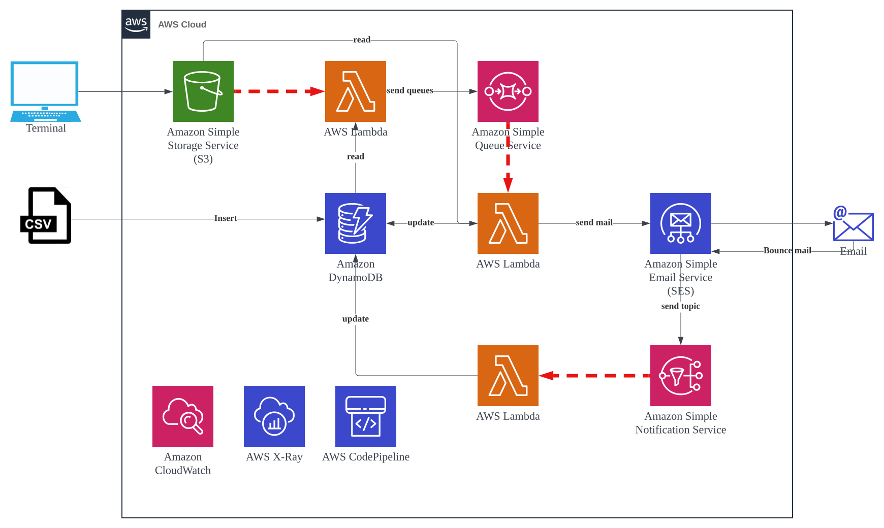

## Lambda integration sample 


### Build and deploy
```sh
sam build -u
sam deploy --guided --capabilities CAPABILITY_IAM CAPABILITY_AUTO_EXPAND
```

### Check output resource
```sh
aws s3 ls
aws sqs list-queues
aws lambda list-functions
aws iam list-roles|grep -i rolename
aws ecr describe-repositories | grep -i repositoryName
```

### Clean up
```sh
sam delete --no-prompts
```
